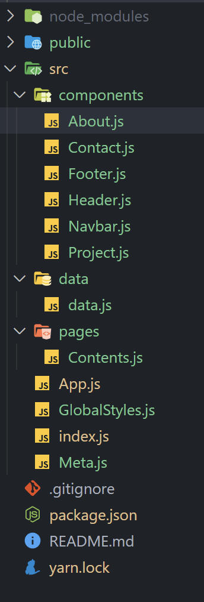

# REACT - W3 Schools Clone

## 전우열 과제

> 2022-05-02

## 파일 구성



<br/>

## DOM 구조


<br/>

## 결과


<hr/>

## src/index.js

```javascript
/**
 * @filename: index.js
 * @description: 프로그램 시작점
 * @author: JEON WOO YEOL
 */

import React from 'react';
import ReactDOM from 'react-dom/client';
import App from './App';

// SEO
import Meta from './Meta';

// 글로벌 스타일
import GlobalStyles from './GlobalStyles';

// 라우팅
import { BrowserRouter } from 'react-router-dom';

const root = ReactDOM.createRoot(document.getElementById('root'));
root.render(
  <React.StrictMode>
    <>
      {/* SEO 태그 */}
      <Meta />

      {/* 글로벌 스타일 */}
      <GlobalStyles />

      {/* 라우팅 */}
      <BrowserRouter>
        <App />
      </BrowserRouter>
    </>
  </React.StrictMode>,
);
```

<hr/>

## src/App.js

```javascript
/**
 * @filename: App.js
 * @description: 컴포넌트 정의
 * @author: JEON WOO YEOL
 */

import React from 'react';
import styled from 'styled-components';
import { Route, Routes } from 'react-router-dom';

import Footer from './components/Footer';
import Navbar from './components/Navbar';
import Header from './components/Header';

import Contents from './pages/Contents';

const AppContainer = styled.div`
  display: flex;
  flex-direction: column;
  justify-content: center;
  align-items: center;
  width: 1564px;
  margin: 0 auto;
`;

const App = () => {
  return (
    <>
      {/* NAVBAR */}
      <Navbar />

      {/* HEADER */}
      <Header />

      <AppContainer>
        <Routes>
          {/* CONTENTS */}
          <Route path="/" export={true} element={<Contents />} />
        </Routes>
      </AppContainer>

      {/* FOOTER */}
      <Footer />
    </>
  );
};

export default App;
```

## src/GlobalStyles.js

```javascript
/**
 * @filename: GlobalStyles.js
 * @description: 전역 스타일 시트
 * @author: JEON WOO YEOL
 */

import { createGlobalStyle } from 'styled-components';

const GlobalStyles = createGlobalStyle`
  * {
    box-sizing: border-box;
    margin: 0;
    padding: 0;
  }

  body {
    font-family: Verdana, sans-serif;
    font-weight: 400;
    font-size: 15px;
    line-height: 22.5px;
  }

  .mainTitle {
    font-family: 'Segoe UI', Arial, sans-serif;
    font-weight: 400;
    font-size: 36px;
    line-height: 54px;
    letter-spacing: 4px;
    color: #f1f1f1;
  }

  .title {
    font-family: 'Segoe UI', Arial, sans-serif;
    font-weight: 400;
    font-size: 24px;
    line-height: 36px;
  }

  .subTitle {
    font-family: 'Segoe UI', Arial, sans-serif;
    font-weight: 400;
    font-size: 15px;
    line-height: 23px;
  }

  a {
    color: #000;
    text-decoration: none;
    outline: none;

    &:hover,
    &:active {
      text-decoration: none;
      color: #000;
    }
  }

  ol,
  ul,
  li {
    list-style: none;
    margin: 0;
    padding: 0;
  }

  img {
    display: block;
    width: 100%;
  }

  button {
    display: block;
    font-family: Verdana, sans-serif;
    font-weight: 400;
    font-size: 15px;
    line-height: 23px;
    line-height: 23px;
    border: none;
    padding: 8px 16px;
    cursor: pointer;
  }
`;

export default GlobalStyles;
```

## src/Meta.js

```javascript
/**
 * @filename: Meta.js
 * @description: SEO 처리
 * @author: JEON WOO YEOL
 */

import React from 'react';
import { Helmet, HelmetProvider } from 'react-helmet-async';

const Meta = (props) => {
  return (
    <HelmetProvider>
      <Helmet>
        <meta charset="utf-8" />
        <title>{props.title}</title>

        {/* SEO 태그 */}
        <meta name="description" content={props.description} />
        <meta name="keywords" content={props.keywords} />
        <meta name="author" content={props.author} />
        <meta name="og:type" content="website" />
        <meta name="og:title" content={props.title} />
        <meta name="og:description" content={props.description} />
        <meta name="og:url" content={props.url} />
      </Helmet>
    </HelmetProvider>
  );
};

Meta.defaultProps = {
  title: 'w3 css templates architect (React)',
  description: 'w3 css templates architect. (React) 예제입니다.',
  keywords: 'React',
  author: 'JEON WOO YEOL',
  url: window.location.href,
};

export default Meta;
```

<hr/>

## src/page/Content.js

```javascript
import React from 'react';
import styled from 'styled-components';

import About from '../components/About';
import Contact from '../components/Contact';
import Projects from '../components/Project';

import data from '../data/data';

const ContentsContainer = styled.div`
  width: 100%;
  padding: 8px 16px;

  .titleArea {
    padding: 32px 16px;

    .title {
      padding: 16px 0;
      margin: 10px 0;
      border-bottom: 1px solid #f1f1f1;
    }
  }
`;

const Contents = () => {
  const { project, about } = data; // 데이터를 받아와서 props로 보낸다.

  return (
    <ContentsContainer>
      {/* PROJECTS */}
      <Projects project={project} />

      {/* ABOUT */}
      <About about={about} />

      {/* CONTACT */}
      <Contact />
    </ContentsContainer>
  );
};

export default Contents;
```

<hr/>

## src/components/Navbar.js

```javascript
import React from 'react';
import { NavLink } from 'react-router-dom';
import Link from 'react-scroll/modules/components/Link';
import styled from 'styled-components';

const NavbarContainer = styled.div`
  display: flex;
  justify-content: flex-start;
  align-items: center;
  position: fixed;
  top: 0;
  left: 0;
  width: 100%;
  padding: 8px 16px;
  background: #fff;
  box-shadow: 0 2px 5px 0 rgb(0 0 0 / 16%), 0 2px 10px 0 rgb(0 0 0 / 12%);
  letter-spacing: 4px;
  z-index: 99999;

  .headerLogo {
    padding: 8px 16px;
  }

  .headerNav {
    display: flex;
    justify-content: center;
    align-items: center;
    margin-left: auto;

    a {
      padding: 8px 16px;
      &:hover {
        background: #ccc;
      }
    }
  }
`;

const Navbar = () => {
  return (
    <NavbarContainer>
      {/* logo */}
      <div className="headerLogo">
        <NavLink to="/">
          <b>BR</b> Architects
        </NavLink>
      </div>

      {/* nav */}
      <div className="headerNav">
        <li>
          <Link to="projects">Projects</Link>
        </li>
        <li>
          <Link to="about">About</Link>
        </li>
        <li>
          <Link to="contact">Contact</Link>
        </li>
      </div>
    </NavbarContainer>
  );
};

export default Navbar;
```

## src/components/Header.js

```javascript
import React from 'react';
import styled from 'styled-components';

const HeaderContainer = styled.header`
  width: 1500px;
  margin: 0 auto;
  position: relative;

  .titleArea {
    position: absolute;
    top: 50%;
    left: 50%;
    transform: translate(-50%, -50%);
    margin-top: 16px;

    .mainTitle {
      margin: 10px 0;
    }

    span:first-child {
      background-color: #000;
      color: #fff;
      padding: 8px 16px;
      opacity: 0.75;
    }
  }
`;

const Header = () => {
  return (
    <HeaderContainer>
      {/* header image */}
      

      {/* header title */}
      <div className="titleArea">
        <h1 className="mainTitle">
          <span>
            <b>BR</b>
          </span>
          <span> Architects</span>
        </h1>
      </div>
    </HeaderContainer>
  );
};

export default Header;
```

## src/components/Project.js

```javascript
import React from 'react';
import styled from 'styled-components';

const ProjectContentContainer = styled.div`
  display: flex;
  justify-content: space-evenly;
  align-items: center;
  flex-wrap: wrap;
  padding: 0 8px;
  row-gap: 16px;

  .projectCard {
    position: relative;
    width: 25%;
    padding: 0 8px;

    .cardTitle {
      position: absolute;
      top: 0;
      padding: 8px 16px;
      background: #000;
      color: #fff;
    }
  }
`;

const ProjectContent = ({ img, subject }) => {
  return (
    <div className="projectCard">
      
      <div className="cardTitle">{subject}</div>
    </div>
  );
};

const Project = ({ project }) => {
  return (
    <div id="projects">
      <div className="titleArea">
        <h2 className="title">Projects</h2>
      </div>

      {/* 데이터를 받아와서 컴포넌트 생성 */}
      <ProjectContentContainer>
        {project.map((v, i) => {
          return <ProjectContent key={i} img={v.img} subject={v.subject} />;
        })}
      </ProjectContentContainer>
    </div>
  );
};

export default Project;
```

## src/components/About.js

```javascript
import React from 'react';
import styled from 'styled-components';

const AboutContainer = styled.div`
  .subTitle {
    margin: 15px 0;
  }
`;

const AboutContentContainer = styled.div`
  display: flex;
  justify-content: space-evenly;
  align-items: center;
  flex-wrap: wrap;
  padding: 0 8px;
  row-gap: 16px;
  margin-bottom: 31px;
  filter: grayscale(75%);

  .aboutCard {
    position: relative;
    width: 25%;
    padding: 0 8px;

    .title {
      margin: 10px 0;
    }

    .subTitle,
    .desc {
      margin: 15px 0;
    }

    .btn {
      width: 100%;

      &:hover {
        background-color: #ccc;
      }
    }
  }
`;

const AboutContent = ({ img, name, position, desc }) => {
  return (
    <div className="aboutCard">
      
      <h3 className="title">{name}</h3>
      <p className="subTitle">{position}</p>
      <p className="desc">{desc}</p>
      <button className="btn">Contact</button>
    </div>
  );
};

const About = ({ about }) => {
  const { content, member } = about;

  return (
    <AboutContainer id="about">
      <div className="titleArea">
        <h2 className="title">About</h2>
        <p className="subTitle">{content}</p>
      </div>

      {/* 데이터를 받아와서 컴포넌트 생성 */}
      <AboutContentContainer>
        {member.map((v, i) => {
          return (
            <AboutContent
              key={i}
              img={v.img}
              name={v.name}
              position={v.position}
              desc={v.desc}
            />
          );
        })}
      </AboutContentContainer>
    </AboutContainer>
  );
};

export default About;
```

## src/components/Contact.js

```javascript
import React from 'react';
import styled from 'styled-components';

const ContactContainer = styled.div`
  .titleArea {
    .subTitle {
      margin: 15px 0;
    }
  }

  .formArea {
    input {
      width: 100%;
      padding: 8px;
      border: 1px solid #ccc;
      margin-bottom: 16px;
      font-size: 15px;
    }

    .btn {
      color: #fff;
      background-color: #000;
      margin: 16px 0;

      &:hover {
        background-color: #ccc;
        color: #000;
      }
    }
  }

  .imgArea {
    width: 1500px;
    margin: 0 auto;
  }
`;

const ContactForm = () => {
  return (
    <form className="formArea">
      <input type="text" placeholder="Name" />
      <input type="email" placeholder="Email" />
      <input type="text" placeholder="Subject" />
      <input type="text" placeholder="Comment" />
      <button className="btn">SEND MESSAGE</button>
    </form>
  );
};

const Contact = () => {
  return (
    <ContactContainer id="contact">
      <div className="titleArea">
        <h2 className="title">Contact</h2>
        <p className="subTitle">
          Lets get in touch and talk about your next project.
        </p>

        {/* Contact Form */}
        <ContactForm />
      </div>

      <div className="imgArea">
        
      </div>
    </ContactContainer>
  );
};

export default Contact;
```

## src/components/Footer.js

```javascript
import React from 'react';
import { NavLink } from 'react-router-dom';
import styled from 'styled-components';

const FooterContainer = styled.footer`
  background-color: #000;
  color: #fff;
  padding: 16px 0;

  p {
    text-align: center;
    height: 52.5px;
    line-height: 52.5px;

    a {
      color: #ccc;
    }
  }
`;

const Footer = () => {
  return (
    <FooterContainer>
      <p>
        Powered by <NavLink to="/">w3.css</NavLink>
      </p>
    </FooterContainer>
  );
};

export default Footer;
```

<hr/>
